# Veyr — a Morrowind-style walk

A first-person exploration world for **Godot 4.7.1** built to look as much like *The Elder Scrolls III: Morrowind* as possible: half-timbered Imperial houses, Redoran crab-shell halls and bell domes, a temple with verdigris pagoda roofs, a Bitter-Coast-style marsh, ash barrens, a timbered mine, and Morrowind's signature atmosphere — heavy weather-tinted fog, a wispy cloud dome, sun glare, two moons, and the classic HUD.

All models, textures and sounds are original and generated by the scripts in `tools/`, except that the player character is built on the CC0 MakeHuman base mesh and its CC0 skin, eye and eyebrow assets. The environment references were used as visual guidance. The retro HUD menu reuses the artwork explicitly supplied by the user; see `assets/ui/README.md`.

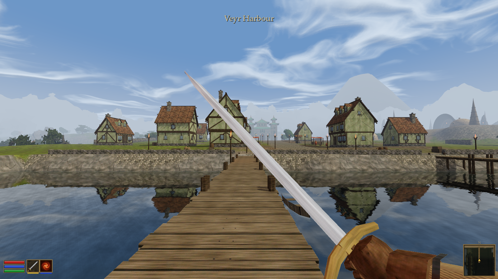

| | |
| --- | --- |
| 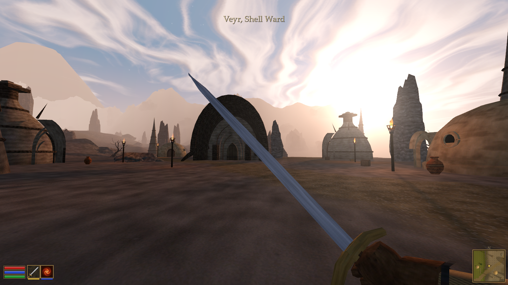 | 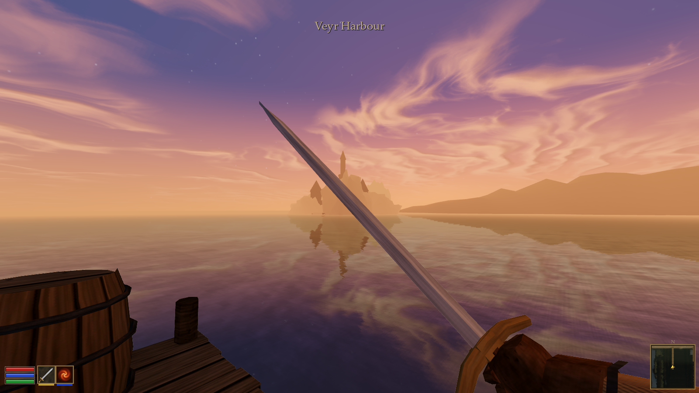 |
| 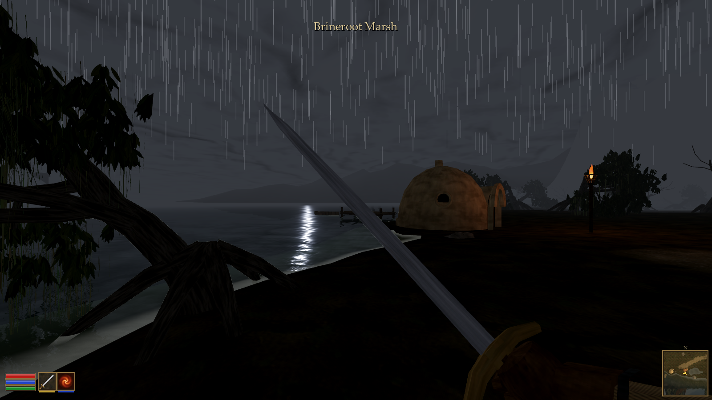 | 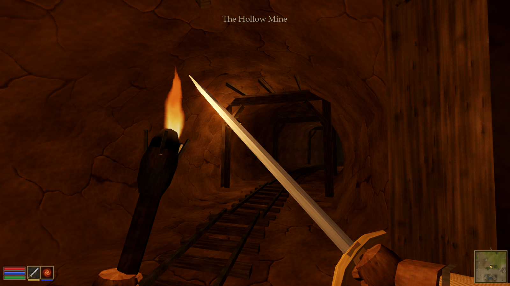 |
| 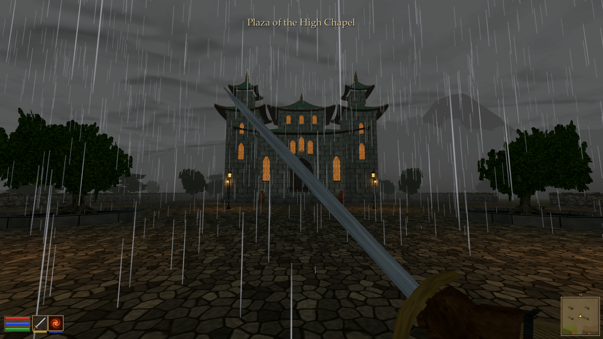 | 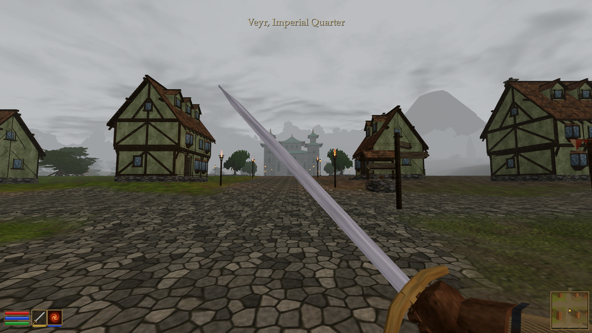 |
| 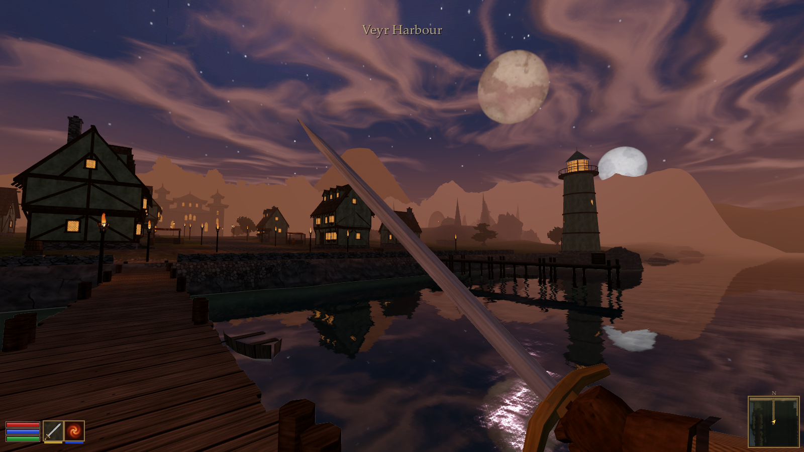 | 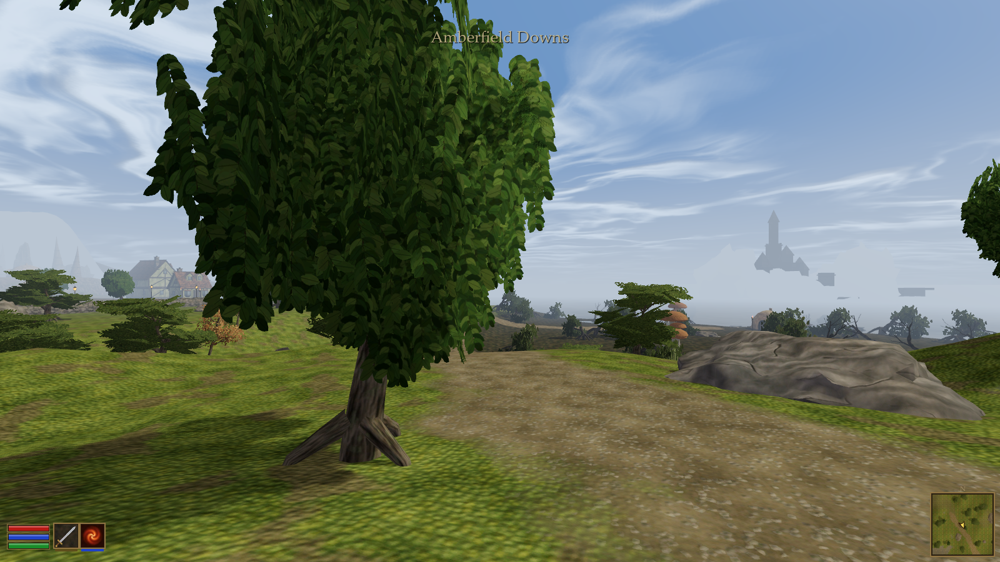 |
| 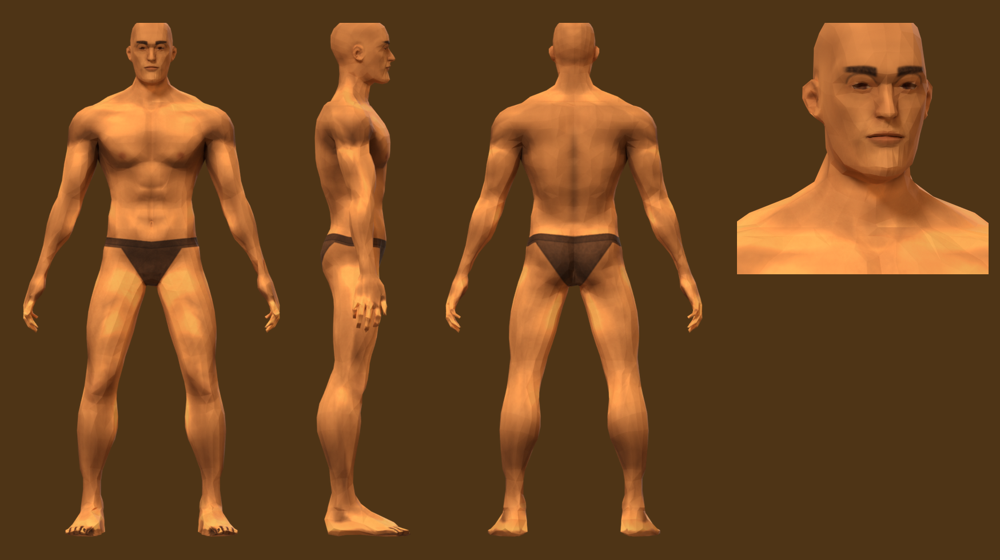 | 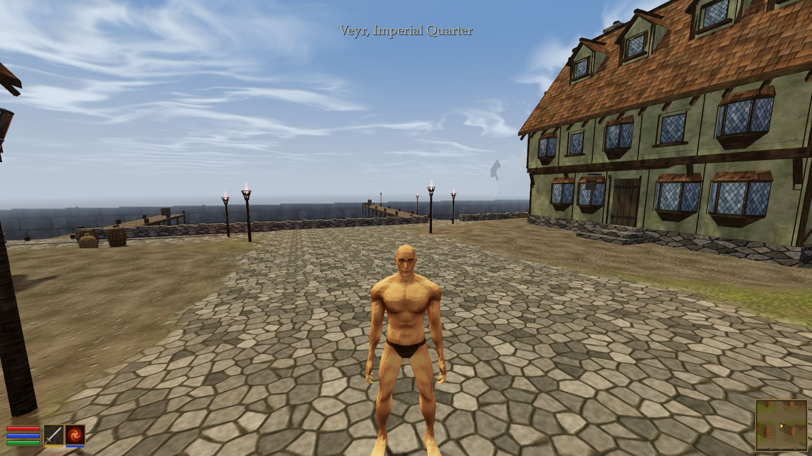 |

## Play

Open `project.godot` in Godot 4.7 and press **F5**. The game opens on the login screen over the harbour:

- **Play offline** starts a private realm inside the game (only this computer can connect) and signs you in with a local account. Your offline characters are kept on this computer.
- **Sign in / Create account** connects to a realm at the given `host:port`. A dedicated realm runs headless with `run_server.bat` (settings in `config/server.cfg`, default port 27840).

Then create up to three characters: a name, sex, race (Human, High Elf or Dark Elf), skin tone and class (Warrior, Priest or Mage). For now race and skin tint and scale the shared body. You arrive at the end of the harbour pier. Harbourmaster Ilvar, on the quay, has work for you. The signed house facing the main street at the top of the quay is the Lantern & Gull tavern: look at its door and press E to go in.

| Key | Action |
| --- | --- |
| WASD / mouse | Walk / look |
| Shift | Run (hold) |
| Caps Lock or Q | Toggle auto-run |
| Space | Jump (swim up in deep water) |
| C or Ctrl | Sneak |
| Tab | Target the next enemy in front of you |
| Left click | Target what is under the crosshair (or under the cursor in interface mode) |
| 1 - 0 | Action bar: attack, class abilities, tonics |
| E / right click | Open the door you are looking at ("E  Enter"), talk to the nearby or targeted NPC, or attack the targeted enemy |
| V | Toggle first / third person |
| F | Ready / sheathe the sword |
| G | Light / put out the torch |
| T | Wait one hour |
| Y | Change the weather |
| F1 | Hide the HUD |
| I | Release the cursor / return to the game |
| Enter | Focus chat / send a message to everyone on the realm |
| Esc | Menu: time, weather, mouse sensitivity, return to the harbour, log out to character select |

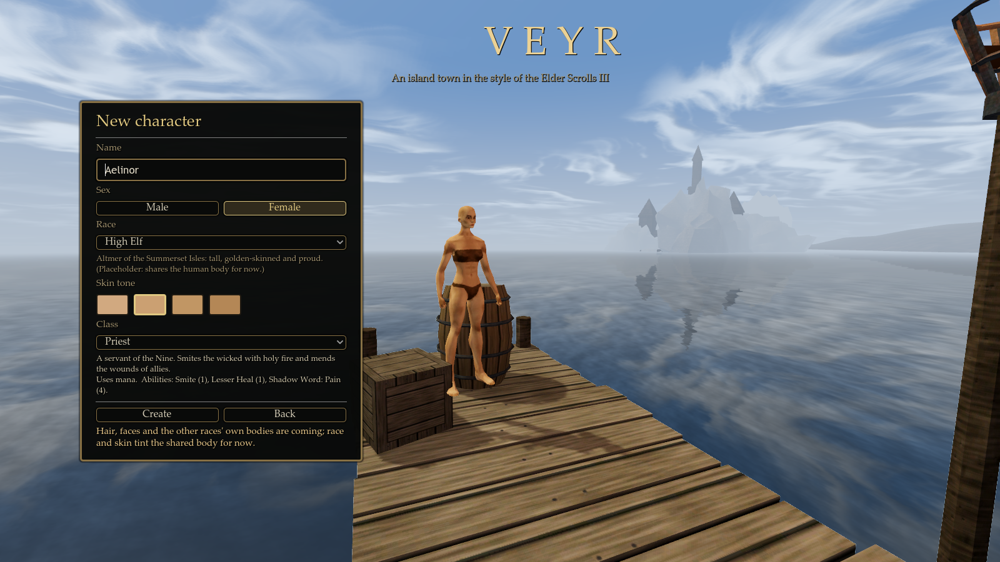
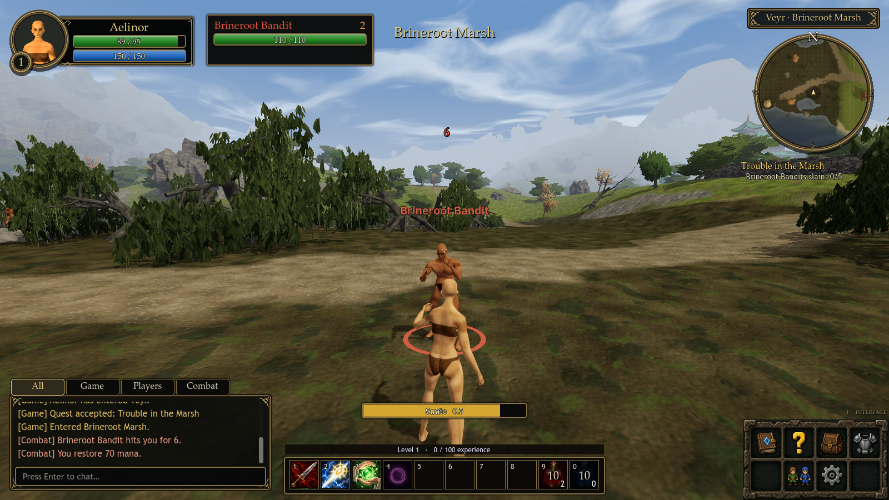

**Classes.** Warriors use rage, which builds as they deal and take blows. Their abilities are Heroic Strike, then Thunder Clap at level 3 and Sundering Blow at 5. Priests use mana for Smite, Lesser Heal and, at level 4, Shadow Word: Pain. Mages use mana for Fireball, then Fire Blast at level 3 and Frostbolt at 5. Casts have cast bars and are interrupted by moving. Abilities share a 1.5 s global cooldown, and some have their own cooldowns. Melee abilities start auto-attack.

**World.** Bandits in Brineroot Marsh (level 2) and Ash Cultists in the Grey Ash Barrens (level 4) aggro, chase, leash and respawn. Kills give experience (up to level 20), gold and loot. Quest givers show **!** and **?** markers. There is a three-quest chain (*Trouble in the Marsh*, *A Word to the Chapel*, *Ashes and Embers*) and a trader who sells tonics and buys loot. The dock's Spellbook, Journal, Inventory, Equipment and Players panels show your character. See [docs/online/README.md](docs/online/README.md) for how the realm works.

**Parties.** Type `/invite <name>` (or target a player and type `/invite`). Party members share kill XP with a group bonus, gold and quest kills, take turns on loot, get party frames and talk with `/p`. `/help` lists the chat commands.

**Editing the game.** All content lives in the realm's SQLite database: races, classes, abilities, items, NPCs, loot, vendors, spawns and quests. Open it with [DB Browser for SQLite](https://sqlitebrowser.org/), edit rows, then type `/reload` in game. The offline account is an admin; on a dedicated realm, set `is_admin = 1` in the `accounts` table. Offline play uses `%APPDATA%/Godot/app_userdata/Veyr - A Morrowind-style Walk/offline/veyr.db`.

## The region

- **Veyr Harbour** — two piers, rowboats, a dressed-stone seawall and a lighthouse on the eastern point.
- **Imperial Quarter** — cobbled streets of plaster-and-timber houses with bay windows and dormers, market stalls, a well and fire baskets.
- **Plaza of the High Chapel** — a paved square with planted trees, iron lamp standards and the copper-roofed temple.
- **Shell Ward** (east, on a raised ash plateau) — a Redoran shell hall, bell domes, Velothi huts and shell spires.
- **Brineroot Marsh** (west) — mud flats and pools, mangrove trees hung with moss, giant mushrooms and a fisher's hut.
- **Amberfield Downs** (north-west) — rolling grassland, trees and a ring of standing stones.
- **Hollow Hills & the Hollow Mine** (north) — a rocky climb to a timber-framed mine with rails, a trestle track and glowing ore in the cavern.
- **Grey Ash Barrens** (north-east) — ash dunes, rock spires and dead trees.
- On the horizon: a mountain ring, a distant volcano and an island fortress across the water.

## What makes it look like Morrowind

- **Weather and time** (`client/world/weather.gd`): Clear, Cloudy, Foggy, Overcast, Rain, Thunderstorm and Ashstorm, each with sunrise/day/sunset/night colours for sky, fog, ambient and sun modelled on the classic `Morrowind.ini` weather tables. Weather blends over time; rain streaks, ash and dust particles, lightning flashes and thunder follow it.
- **Sky** (`shaders/sky.gdshader`): sky colour fading to the fog colour at the horizon, a scrolling cloud layer on a flattened dome (the radial streaks at sunset), a glaring sun, two moons and a star field.
- **Fog**: linear-style depth fog that swallows the land, matched to the sky horizon. Far landmarks use `shaders/distant.gdshader` so they read as hazy silhouettes, like distant land.
- **Sun glare** (`client/ui/sun_glare.gd`): the bloom that floods the screen when you look at an unobstructed sun.
- **Materials**: matte Lambert surfaces with no specular, painterly 256–512 px textures with baked relief, vertex-colour ground darkening, alpha-tested foliage cards that sway in the wind.
- **Water** (`client/world/water_reflection.gd`, `shaders/water.gdshader`): planar reflections, refraction with depth absorption and ripples.
- **HUD** (`client/ui/hud.gd`): a character portrait with green health and blue mana at top left, a circular north-up world map and current zone at top right, All/Game/Players/Combat chat tabs at bottom left, and a RuneScape-inspired stone menu at bottom right. Enter opens local chat; I releases the cursor. Portraits follow the selected body model; values come from exported player stats. See `docs/hud/README.md`.
- **First person**: a longsword in the right hand and a torch in the left (`client/player/player.gd`), drawn without clipping into walls.
- **Player model**: a heavily muscled, bald man in leather briefs, built low-poly like an old-school 3D character: smooth (Gouraud-style) shading over a faceted reference shape: about 4,800 triangles on one 1024² texture painted with natural tanned skin, soft muscle definition and abs, stubble, brows and suede briefs. The body is MakeHuman's anatomy decimated so the facets follow the muscles; the head and the simple block feet (toes painted, not modelled) come from MakeHuman's hand-built low-poly proxy and are stitched on at the neck and ankles. Press Tab to see him in third person; he has 73 animations retargeted by `tools/retarget_animations.py`, mostly from the CC0 Quaternius Universal Animation Libraries 1 and 2: locomotion (with a heroic polish on idle/walk/run), sword combos, block and shield, punches, hits, knockback, death, jumps, rolls, spells, swimming, interactions and emotes. The game plays idle, walk, run (an MMO-style jog) and the jump/fall/land set; the rest are ready for future mechanics.
- **Female player model** (`assets/models/player_body_female.glb`, scene `scenes/props/player_body_female.tscn`): an athletic, long-legged bald woman in a suede bandeau and bikini briefs, built by the same pipeline with `tools/build_character.py -- --female` (MakeHuman female body, head and feet; about 4,800 triangles; smooth shading; one 1024² texture). Its final shape is fitted to the supplied turnaround (thighs, glutes, jaw and limb proportions); see `docs/character_female/README.md` for before/after renders and the preserved original. Rigged with the same 53 bone names and hierarchy as the male, with rest positions fitted to her body. No animation clips yet; not used by the player yet. Editable rig: `docs/character_female/rig/player_body_female_rigged.blend`.
- **Interiors**: walking into the mine fades the outdoor light to warm, dark interior lighting.

## Project layout

- `shared/` — `protocol.gd` (version, message names, tick rates) and `link.gd` (the RPC transport). The only code both sides share.
- `server/` — the authoritative realm (see [docs/online/README.md](docs/online/README.md)): `realm.gd`, `net/` (gateway, accounts, replication), `sim/` (one file per game system), `persistence/` (SQLite schema, migrations, repository), `content/` (content loader and the seed for new databases), `world/` (zones and their baked collision). `server/server.tscn` is the dedicated realm.
- `client/` — everything the player sees: `main.gd` (boot, front end, offline realm), `net/session.gd`, `content/catalog.gd` (display data from the realm), `world/`, `player/`, `ui/`, `actors/`.
- `scenes/main.tscn` — the game's boot scene; `scenes/world/veyr.tscn` — the generated world (still runnable on its own).
- `shaders/` — sky, terrain, water, foliage, distant haze, flame, glare.
- `materials/` — generated material resources (from `tools/materials.json`).
- `assets/textures/`, `assets/models/`, `assets/audio/` — generated art.
- `assets/terrain_src/` — heightmap, splat maps and `layout.json` written by the terrain generator (not imported by Godot); `assets/terrain/` holds the Godot-ready chunks built from it.
- `tools/` — every generator (see below), `bake_server_world.gd` (the server's collision copy of the world), `bot_client.gd` (a protocol-only test client) and the checks `verify_world.gd`, `verify_hud.gd` and `verify_online.gd`.

## Rebuilding

Everything is checked in, so this is only needed after changing a generator. Requirements: Python 3.10+ with numpy and Pillow, the bundled `Blender/blender.exe` (5.2, background mode) with the [MPFB 2](http://static.makehumancommunity.org/mpfb.html) extension installed in its user profile, the CC0 MakeHuman system assets in `Blender/mh_assets/system_assets/`, and the Godot 4.7.1 console executable.

```powershell
.\tools\rebuild.ps1
```

It runs, in order:

1. `python tools/build_textures.py` — all surface, foliage, sky, moon and HUD textures.
2. `python tools/build_terrain.py` — heightmap, splat/tint maps, roads, mine path and every object placement (`assets/terrain_src/layout.json`; also writes `docs/map_overview.png`).
3. `python tools/build_audio.py` — ambient loops and footsteps.
4. `Blender/blender.exe --background --factory-startup --python tools/build_models.py` — all GLB models (`tools/models_*.py`). Add `-- --preview <dir> [names]` to render quick Workbench previews.
5. `Blender/blender.exe --background --python tools/build_character.py` — the player model (no `--factory-startup`, because MPFB is a user extension). MPFB builds and poses the MakeHuman body; the body is decimated, MakeHuman's low-poly proxy head is attached at the neck, and Cycles (GPU) bakes skin, eyes, ambient occlusion, muscle relief and surface positions onto it, which are painted together into `char_body.png`. Body shape, pose and paint settings are at the top of the script. After rebuilding the character, run `Blender/blender.exe --background --python-exit-code 1 --python tools/rig_character.py` to bind its 53-bone skeleton, then `Blender/blender.exe --background --python-exit-code 1 --python tools/retarget_animations.py` to retarget the animation clips onto it (`tools/rebuild.ps1` runs both). Add `-- --preview <dir>` for front/side/back/face renders.
6. `Godot --headless --editor --path . --import`
7. `Godot --headless --path . --script res://tools/build_world.gd` — materials, prop scenes, terrain chunks and `veyr.tscn`.

Edits made by hand in `veyr.tscn` are overwritten by step 7; put lasting changes in the generators. Object placement lives in `tools/build_terrain.py` (buildings, roads and scatter rules), weather colours in `client/world/weather.gd`, and material settings in `tools/materials.json`.

### Checks and screenshots

```powershell
& '..\Godot_v4.7.1-stable_win64_console.exe' --headless --fixed-fps 60 --path . --script res://tools/verify_world.gd
```

walks the player along the main routes (pier → quay → main street → plaza → temple stairs, north road → through the mine, east road → Shell Ward, west road → marsh) and checks swimming, weather, waiting, the third-person view and the menu.

Preview screenshots: pass a JSON list of shots to the game, e.g. `Godot --path . -- --shots=C:/path/shots.json`, where each entry is `{"file", "pos": [x, y, z], "yaw", "pitch", "hour", "weather", "torch", "weapon", "hud", "third_person", "model_yaw"}`.


### Player skeleton and locomotion

The player GLB contains a weighted 53-bone skeleton (including fingers and toe joints) and looping `idle`, `walk`, and `run` clips. The player controller blends between them, scales playback to actual speed, and turns the body toward travel. Press **Tab** for third person, **WASD** to walk and **Shift** to run. Default movement speeds are 1.45 m/s walking and 3.6 m/s running, matched to natural stride lengths.

The editable source is `docs/character_animation/player_body_rigged.blend`. See [character animation notes](docs/character_animation/README.md) for clip timing and the focused rebuild commands.

